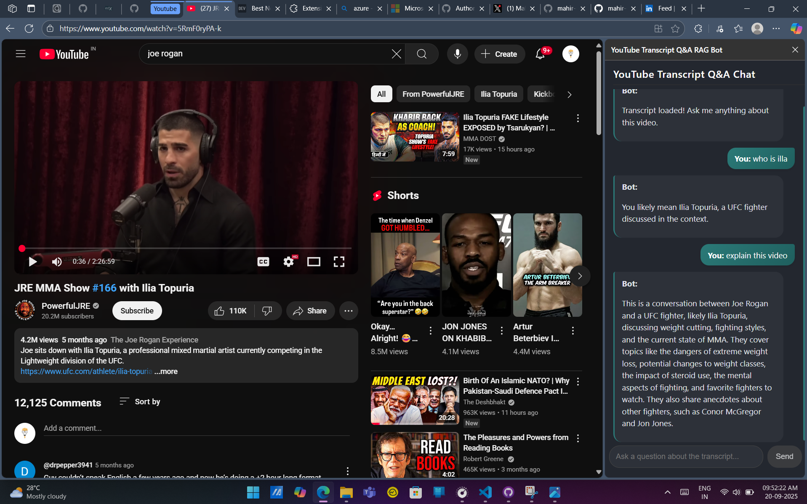

///Clone the repository:

git clone https://github.com/yourusername/youtube-video-Transcript-Q-A-RAG-bot.git
cd youtube-video-Transcript-Q-A-RAG-bot

///2.
npm install

///Create a .env file in the root directory with your Gemini API key:
gemini_api_key=your_api_key_here

///Build the frontend:
cd client
npm run build
cd ..

Contact
Mahir Mankad - @mahir_mankad12- mahirmankad69@gmail.com
